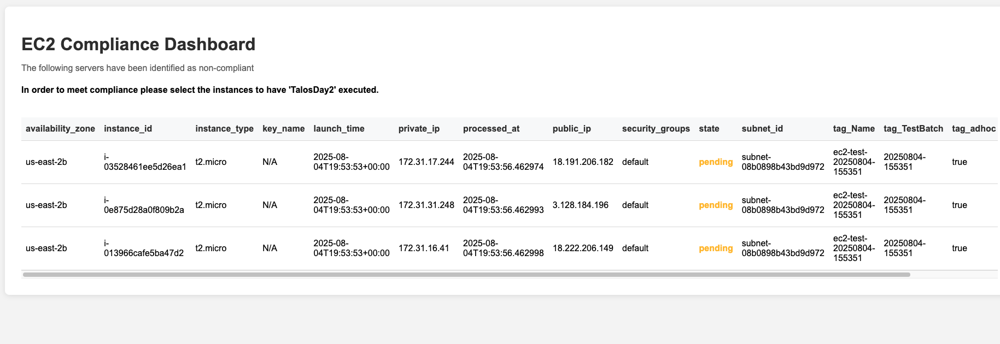

# EC2 Launch Monitor

## Overview

The EC2 Launch Monitor is a serverless compliance monitoring system that automatically tracks and reports EC2 instances launched with specific tags in AWS environments. The system provides real-time visibility into adhoc infrastructure deployments through an automated dashboard that aggregates instance data into daily compliance reports.

## System Architecture

The solution employs a fully serverless architecture built on AWS services, providing cost-effective monitoring without requiring dedicated infrastructure management.

### Core Components

- **CloudWatch Events Rule**: Captures EC2 `RunInstances` API calls in real-time
- **Lambda Function**: Processes launch events and filters for tagged instances
- **S3 Static Website**: Hosts the compliance dashboard with automated data loading
- **S3 Report Storage**: Maintains daily CSV reports with structured instance data

## Operational Flow

```
EC2 Launch Event → CloudWatch Events → Lambda Function → S3 Report Storage
                                          ↓
Static Dashboard ← S3 Website Hosting ← Compliance Reports (CSV)
```

### Event Processing Pipeline

1. **Event Capture**: CloudWatch Events automatically detects EC2 instance launches across the AWS account
2. **Tag Filtering**: Lambda function examines each launched instance for the `adhoc=true` tag
3. **Data Collection**: Tagged instances have their metadata extracted and structured
4. **Report Generation**: Instance data is appended to daily CSV reports stored in S3
5. **Dashboard Display**: Static website dynamically loads and displays current day's compliance data

## Monitoring Scope

The system specifically tracks EC2 instances with the following tag configuration:
- **Tag Key**: `adhoc`
- **Tag Value**: `true`

### Captured Instance Metadata

- Instance ID and Type
- Private and Public IP Addresses
- Launch Time and Availability Zone
- VPC and Subnet Configuration
- Security Group Assignments
- Key Pair Associations
- Complete Tag Inventory
- Processing Timestamps

## Data Organization

Reports are organized in a hierarchical S3 structure:
```
ec2-launch-reports/
├── YYYY/
│   └── MM/
│       └── ec2-instances-YYYY-MM-DD.csv
```

Each daily report contains cumulative instance data, with new launches appended throughout the day to maintain a complete compliance record.

## Dashboard Features

The compliance dashboard provides:
- **Automated Data Loading**: Dynamically fetches current day's launch data
- **Fallback Reporting**: Displays static sample data when no launches have occurred
- **Status Visualization**: Color-coded instance states for quick assessment
- **Responsive Design**: Mobile-friendly interface for monitoring from any device

## Security Implementation

- **IP-Restricted Access**: Dashboard access limited to authorized IP addresses
- **Private S3 Bucket**: Report storage uses private bucket with restrictive policies
- **IAM Role Isolation**: Lambda function operates with minimal required permissions
- **No Public API Exposure**: All data access occurs through secure S3 website hosting

## Compliance Benefits

- **Real-time Monitoring**: Immediate visibility into adhoc instance deployments
- **Historical Tracking**: Persistent daily reports for audit and analysis
- **Automated Reporting**: No manual intervention required for compliance data collection
- **Cost Optimization**: Serverless architecture minimizes operational overhead

## Technical Implementation

### AWS Resources Deployed

| Resource | Purpose | Configuration |
|----------|---------|---------------|
| **Lambda Function** | Event processing and data extraction | Python 3.11, minimal memory footprint |
| **CloudWatch Events Rule** | EC2 launch event filtering | Filters `RunInstances` API calls |
| **S3 Unified Bucket** | Dashboard hosting and report storage | Static website configuration, lifecycle policies |
| **IAM Roles** | Secure service permissions | Least-privilege access patterns |

### Data Processing Logic

The Lambda function implements efficient batch processing:
- Single API call to retrieve instance metadata
- In-memory filtering and data transformation
- Atomic CSV file operations with append functionality
- Comprehensive error handling and retry mechanisms

### Frontend Architecture

The dashboard uses modern web technologies:
- **Dynamic Loading**: JavaScript fetches CSV data from S3 using relative paths
- **Graceful Degradation**: Automatic fallback to static sample data
- **Responsive Layout**: CSS Grid and Flexbox for cross-device compatibility
- **Status Indicators**: Visual styling for instance state recognition

## Project Structure

```
ec2-launch-monitor/
├── cf-template/
│   └── cloudformation-clean.yaml     # Complete infrastructure definition
├── lambda/
│   ├── index.py                      # Event processing logic
│   └── ec2_helper.py                 # Utility functions
├── src/
│   ├── index.html                    # Dashboard interface
│   ├── style.css                     # Responsive styling
│   └── script.js                     # Data loading and rendering
├── images/
│   └── dashboard.png                 # Dashboard screenshot for README
├── tasks/
│   ├── check_s3.sh                   # S3 report verification
│   ├── cleanup_ec2.sh                # Test resource cleanup
│   ├── create_ec2.sh                 # Test instance creation
│   ├── deploy.sh                     # Full stack deployment
│   └── predeploy.sh                  # Deployment automation
└── README.md                         # This documentation
```

## Dashboard Screenshot



The dashboard displays:
- Real-time compliance data in tabular format
- Color-coded status indicators for quick assessment
- Mobile-responsive design for field access
- Automated refresh of current day's launch data

---

*This documentation reflects the current state of the feature/reviewboard branch implementation.*

